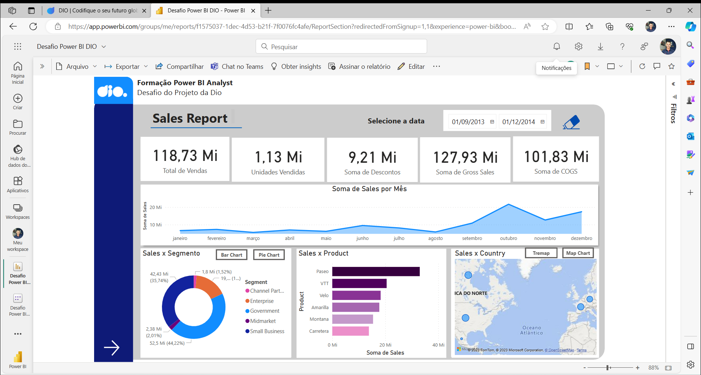
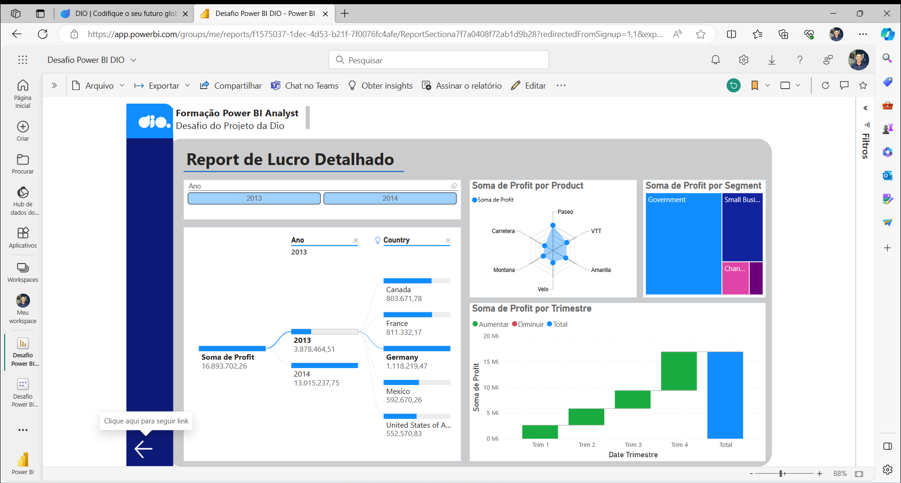

# Power_bi_analyst

Repositório relacionado a formação de Power BI Analyst

# Desafio de Power BI - Relatório Financeiro

Neste projeto, participei de um desafio que me permitiu aprimorar minhas habilidades em Power BI e criar um relatório financeiro mais elaborado. Durante o desafio, adquiri e utilizei conhecimentos em:

- Importação de dados financeiros a partir de arquivos CSV.
- Criação de layouts de relatórios eficazes, incluindo grids, caixas de texto e imagens.
- Desenvolvimento de gráficos e visualizações de dados significativas com base nos dados de amostra fornecidos.
- Implementação de botões de navegação para facilitar a alternância entre páginas e visuais diferentes.
- Uso de segmentadores de dados para permitir a interação dos usuários com o relatório.
- Publicação do relatório no Power BI Service para compartilhamento online.
- Uso Personalizações avançadas, como ações personalizadas nos botões.

Este projeto demonstra meu comprometimento em explorar e aplicar conceitos de Business Intelligence, fornecendo uma amostra de meu portfólio de projetos técnicos no Power BI. Ele reflete minha capacidade de criar relatórios informativos e interativos, que podem ser valiosos para tomadas de decisão informadas.

Este desafio é uma parte essencial do meu contínuo desenvolvimento em análise de dados e visualização, e estou ansioso para receber feedback e aprimorar ainda mais minhas habilidades.

Obrigado por conferir este projeto!

